# Browserjack: OpenAI Codex browser bridge for MCP

[](https://github.com/stickerdaniel/browserjack/actions/workflows/ci.yml)
[](https://www.npmjs.com/package/browserjack)
[](LICENSE)

Browserjack lets Claude Code and other MCP clients use the browser runtime that ChatGPT.app already installed on your Mac. Your agent gets a persistent Node.js REPL that drives your real, signed-in Chrome or Helium profile. Browserjack injects nothing into the browser and installs no extension of its own.

> [!NOTE]
> Your agent acts in your logged-in browser sessions. The OpenAI interfaces it uses are undocumented, and any ChatGPT.app update can break them.

## Requirements

- macOS on Apple Silicon with Node.js 22 or newer
- The official ChatGPT.app with the ChatGPT/Codex extension set up in Chrome or Helium
- Claude Code or another stdio MCP client

## Quickstart

```bash
npx browserjack setup --client claude --scope user
npx browserjack doctor --live
```

`setup` installs a versioned runtime in `~/Library/Application Support/browserjack/` and registers a stable shim with Claude Code, so later changes to the `npx` cache cannot change what Claude Code runs. `doctor --live` tests the browser handshake end to end.

Restart Claude Code and ask:

```text
Use the browserjack MCP server to open https://example.com and return the page title.
```

Claude should answer `Example Domain`. If it doesn't, run `npx browserjack doctor` and see [docs/troubleshooting.md](docs/troubleshooting.md).

## How it works

Browserjack is a thin launcher and stdio proxy. It starts the OpenAI-signed `codex sandbox`, which runs OpenAI's own `node_repl`, and passes MCP messages between that runtime and your client. Every browser feature comes from the runtime. Browserjack has no Playwright, CDP, or navigation code and does not modify or redistribute OpenAI software.

<picture>
  <source media="(prefers-color-scheme: dark)" srcset="docs/assets/architecture-dark.svg">
  
</picture>

Compared with Playwright MCP, Browser MCP, or Claude Code's [Chrome integration](https://code.claude.com/docs/en/chrome), Browserjack reuses the OpenAI stack already on your Mac, gives the agent a REPL with macOS computer use instead of a fixed tool list, works with any stdio MCP client, and needs no Anthropic plan. In exchange it runs only on macOS and needs upkeep for new ChatGPT.app builds. If you have a direct Anthropic plan, the Chrome integration is the supported cross-platform choice.

## Commands

```text
browserjack run          Start the stdio MCP server (Claude Code calls this)
browserjack doctor       Check ChatGPT.app, signatures, runtime, compatibility
       --json            Machine-readable report
       --live            Also cold-start the runtime and test the handshake
browserjack status       Show version, shim, current link, and Node path
browserjack setup        Install the runtime and register the MCP server
       --client          claude (direct MCP) or plugin (runtime only)
       --scope           user | local | project
       --mcp-name NAME   MCP server name (default: browserjack)
browserjack update       Reinstall this version with the recorded MCP identity
browserjack uninstall    Remove the installation and its MCP entry
       --keep-state      Remove only the active link and shim
```

`doctor` and `status` exit with 2 when a check fails and 1 on an unexpected error.

## Compatibility

After a ChatGPT.app update, the first start runs a one-time self-test with a real browser handshake. A build that passes starts instantly from then on. A build that fails stays blocked until a Browserjack update. If a new build misbehaves in a way the self-test misses, open a compatibility issue with your `doctor --json` output and remove your username from the paths.

## Security and privacy

Each launch runs the checks in the diagram. The sandbox lets the runtime write only to `CODEX_HOME` and temp directories. Browserjack has no telemetry and logs no browser content, cookies, tokens, or form data. Whatever the MCP client requests does enter that client's conversation. Details are in [docs/security.md](docs/security.md) and [docs/privacy.md](docs/privacy.md). Report vulnerabilities as described in [SECURITY.md](SECURITY.md).

## FAQ

**Why only macOS?** Browserjack needs the runtime and code-signed native hosts that ship with ChatGPT.app for macOS. Windows and Linux have no local runtime to reuse.

**Is this supported by OpenAI?** No. Browserjack is not affiliated with or endorsed by OpenAI or Anthropic.

**Is "browserjack" a hijacker?** No. The name means jack as in connector. It only connects components you installed yourself.

## Contributing

Run `npm install && npm run verify`, then read [CONTRIBUTING.md](CONTRIBUTING.md).

MIT for this project's original code. OpenAI components remain under their own terms and licenses.
